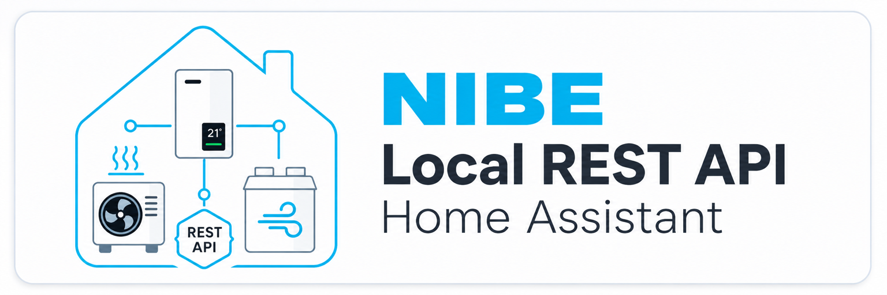

  <picture>
    <source media="(prefers-color-scheme: dark)" srcset="custom_components/nibe_local/brand/dark_logo.png">
    <source media="(prefers-color-scheme: light)" srcset="custom_components/nibe_local/brand/logo.png">
    
  </picture>

# NIBE Local REST API – Home Assistant Custom Integration

> 🏠 **Lokal** · 🔒 **Sicherheitsorientiert** · ☁️ **ohne Cloud-Zwang** · 🌡️ **Heizung** · ❄️ **Kühlung** · 💧 **Brauchwasser** · 🌬️ **Lüftung**

Diese Custom Integration bindet eine NIBE-Anlage über die **lokale REST API** direkt in Home Assistant ein. Für das normale Auslesen und die unterstützten Steuerfunktionen ist keine Verbindung zu myUplink erforderlich.

Die Integration wurde für eine Anlage mit **VVM S320, S2125 und ERS S40-400** entwickelt und wird dort im realen Betrieb getestet. Andere Geräte oder Anlagenkonfigurationen können ebenfalls funktionieren, sind aber nicht automatisch vollständig verifiziert.

Aktuelle Integrationsversion: **0.9.4.1**

---

## Inhalt

- [Funktionsumfang](#-funktionsumfang)
- [Entitätsprofile](#-entitätsprofile)
- [Individuelle Auswahl](#-individuelle-auswahl)
- [Entitätsvorschau vor dem Anwenden](#-entitätsvorschau-vor-dem-anwenden)
- [Benennung der Entitäten](#-benennung-der-entitäten)
- [Unterstützte Home-Assistant-Plattformen](#-unterstützte-home-assistant-plattformen)
- [Schreibzugriffe und Sicherheitsmodell](#-schreibzugriffe-und-sicherheitsmodell)
- [Heizung und Kühlung](#-heizung-und-kühlung)
- [Brauchwasser](#-brauchwasser)
- [Lüftung](#-lüftung)
- [Verdichter, Außeneinheit und Abtauung](#-verdichter-außeneinheit-und-abtauung)
- [Alarme und Diagnose](#-alarme-und-diagnose)
- [Authentifizierung und TLS](#-authentifizierung-und-tls)
- [Kommunikation, Polling und Robustheit](#-kommunikation-polling-und-robustheit)
- [Voraussetzungen](#-voraussetzungen)
- [Installation](#-installation)
- [Optionen nach der Einrichtung](#-optionen-nach-der-einrichtung)
- [Updates und Beständigkeit](#-updates-und-beständigkeit)
- [Grenzen und bekannte Einschränkungen](#-grenzen-und-bekannte-einschränkungen)
- [Entwicklung und Tests](#-entwicklung-und-tests)
- [Haftung](#-haftung)

---

## ✨ Funktionsumfang

Die Integration liest die von der lokalen REST API bereitgestellten Anlagenvariablen und bildet bekannte Punkte auf passende Home-Assistant-Entitäten ab.

Unterstützt werden unter anderem:

- 🌡️ Außen-, Vorlauf-, Rücklauf-, Raum-, Brauchwasser- und Lüftungstemperaturen
- 🔥 Heizungswerte, Gradminuten, Heizkurve und berechnete Vorlauftemperaturen
- ❄️ Kühlstatus, Kühlgradminuten, Kühlkurve und Kühlfreigabe
- 💧 Brauchwasserbedarf, Temperaturen, Zeitprogramme und Zusatzfunktionen
- ⚙️ Verdichterstatus, Frequenz, Leistung, Strom, Starts und Betriebszeiten
- 💨 Pumpen-, Hydraulik- und Ventilatorwerte
- 🌬️ Lüftungsmodus, Luftfeuchtigkeit, Temperaturen und Nachtabsenkung
- 🧊 EEV-/EVI-, Kältekreis- und Abtauwerte
- ⚡ Energie- und Leistungswerte
- 🚨 Alarm- und Meldungsinformationen
- 🎛️ geprüfte Schreibfunktionen über `switch`, `select`, `number` und `time`
- 🩺 Diagnose-Entitäten für API-Erreichbarkeit, Fallback und Verbindungsfehler
- 🔔 Benachrichtigungen bei Authentifizierungs- und längeren Verbindungsproblemen
- 🧩 mehrere NIBE-Config-Entries ohne Kollision der Entity-Unique-IDs

Welche Entitäten tatsächlich angelegt werden, bestimmt seit **0.9.0** das gewählte Entitätsprofil.

---

## 🧩 Entitätsprofile

Nach erfolgreicher Eingabe der Verbindungs- und Authentifizierungsdaten liest die Integration zuerst die tatsächlich verfügbaren Variablen des Geräts ein. Anschließend kann der gewünschte Umfang gewählt werden.

Im Einrichtungsdialog wird zusätzlich angezeigt, wie viele Variablen des verbundenen Geräts in den jeweiligen Profilen verfügbar sind.

| Profil | Zweck | Verhalten |
|---|---|---|
| **Minimal** | Kernwerte für Dashboard und Grundbetrieb | Kernzustände, Haupttemperaturen, Brauchwassertemperaturen sowie Verdichterstatus und -frequenz |
| **Standard** | Typische Home-Assistant-Nutzung | Minimal plus häufig benötigte Heiz-/Kühlwerte, Komfortfunktionen, Energie, Verdichterdetails, Abtau- und grundlegende Lüftungswerte |
| **Erweitert** | Ausführliche Anlagenanalyse | Der vollständig kuratierte und von dieser Integration bekannte `POINTS`-Umfang einschließlich detaillierter Diagnose- und Servicewerte |
| **Komplett** | Maximale Sichtbarkeit | Alle von der lokalen API aktuell gemeldeten Variablen; bekannte Punkte mit ihrer definierten Plattform, unbekannte Punkte ausschließlich als Read-only-Sensor |
| **Individuell** | Volle Auswahlkontrolle | Der Nutzer wählt nach der Erkennung selbst die gewünschten Variablen aus |

### Minimal

Das Minimal-Profil konzentriert sich auf den normalen Anlagenzustand, zum Beispiel:

- Außentemperatur
- Vorlauf und Rücklauf
- Raumtemperatur
- Brauchwassertemperaturen BT7, BT6 und BT70
- Betriebspriorität und Betriebsmodus
- Verdichterstatus und Verdichterfrequenz

### Standard

Standard erweitert Minimal unter anderem um:

- mittlere Außen- und Raumtemperatur
- berechnete Heiz- und Kühlvorläufe
- Heiz- und Kühlkurven
- ausgewählte Brauchwasserparameter und Zeitprogramme
- Energie- und Leistungswerte
- Verdichterstarts und Betriebszeiten
- relevante Außeneinheit-/Kältekreiswerte
- Abtauzustand
- grundlegende Lüftungswerte

### Erweitert

Erweitert entspricht dem großen, von der Integration gepflegten bekannten Punktumfang. Dazu gehören zusätzlich zahlreiche:

- Hydraulikwerte
- detaillierte Verdichterwerte
- EEV-/EVI-Werte
- Abtau- und Diagnosewerte
- Lüftungsparameter
- Zusatzheizungs- und Serviceinformationen

Für bestehende Konfigurationen aus Versionen vor 0.9.0 wird **Erweitert** als Kompatibilitätsstandard verwendet, damit der bisherige Umfang nicht überraschend reduziert wird.

### Komplett

Komplett zeigt zusätzlich Variablen, die der installierten Integrationsversion noch nicht als eigener `PointDef` bekannt sind.

**Wichtig:** Ein unbekannter Punkt wird immer nur lesend als generischer Sensor bereitgestellt – selbst wenn die lokale API für ihn `isWritable=true` meldet.

Damit bedeutet „Komplett“ ausdrücklich:

> **Alle verfügbaren Werte sichtbar machen, aber nur verstandene und von der Integration explizit abgesicherte Funktionen beschreibbar machen.**

---

## ☑️ Individuelle Auswahl

Bei **Individuell** wird nach der Verbindung die Liste der tatsächlich vom Gerät gemeldeten Variablen angezeigt.

Die Auswahl wird als **anklickbare Mehrfachliste mit Checkboxen** dargestellt. Bekannte Punkte zeigen ihren lokalisierten Namen zusammen mit **Variable-ID und Einheit**; bei nicht kuratierten Punkten wird zusätzlich ein von der lokalen API gelieferter Name verwendet, sofern vorhanden.

Die Auswahl enthält – soweit von der lokalen API geliefert – unter anderem:

- Variable-ID
- Beschreibung
- Einheit

Es werden die **konkreten Variable-IDs** gespeichert. Dadurch bleibt die Auswahl erhalten bei:

- Neustart von Home Assistant
- Reload der Integration
- Änderung anderer Optionen
- Update der Custom Integration

Die Auswahl kann später erneut über die Integrationsoptionen geändert werden.

---

## 🔎 Entitätsvorschau vor dem Anwenden

Vor dem Abschluss der Ersteinrichtung und vor dem Speichern geänderter Optionen zeigt die Integration eine letzte **Entitätsübersicht**. Dadurch ist vorab sichtbar, welche Auswirkungen das gewählte Profil oder die individuelle Auswahl hat.

Die Vorschau zeigt:

- **aktiv / ausgewählt** – erkannte Punkte, die nach dem Bestätigen bereitgestellt werden
- bei bestehenden Installationen zusätzlich, wie viele davon **bereits in der Entity Registry** vorhanden und wie viele **neu** sind
- **nicht ausgewählt / abgewählt** – Punkte, die nicht zum gewählten Umfang gehören und nicht zur Löschung vorgesehen sind
- **zur Registry-Löschung vorgesehen** – ausschließlich die numerischen Punkt-Entitäten, die die optionale Registry-Bereinigung tatsächlich entfernen würde
- **zusätzliche Integrationsentitäten** wie API-Erreichbarkeit, Fallback-Status, Meldungen/Alarme und – falls verfügbar – Smart Mode oder Lüftung+

Die Einträge werden mit **Name, Variable-ID und Einheit** dargestellt. Bei sehr großen Anlagen werden pro Bereich höchstens 50 Einträge angezeigt; die angezeigten Zähler enthalten trotzdem immer den vollständigen Umfang.

**Wichtig:** Ein angefordertes Backup und die Registry-Bereinigung werden erst nach der Bestätigung dieses letzten Dialogs ausgeführt. Wird der Dialog verlassen, bevor bestätigt wurde, erfolgt keine Registry-Löschung. Schlägt das angeforderte Backup fehl, bleibt die bereits vorhandene Schutzlogik bestehen und es wird nichts aus der Registry gelöscht.

---

## 🏷️ Benennung der Entitäten

Seit 0.9.0 kann bei der Einrichtung und später in den Optionen gewählt werden, wie die Integration den **Entitätsnamen** bereitstellt.

### Home-Assistant-Standard – empfohlen

Die Integration verwendet ihre übersetzten Home-Assistant-Namen und `translation_key`s.

Beispiel:

`Außentemperatur (BT1)`

Dies ist der empfohlene Modus und passt am besten zum modernen Home-Assistant-Namensmodell.

### Lokale API

Der Name wird möglichst direkt aus der Beschreibung der lokalen REST API übernommen.

Beispiel:

`Current outdoor temperature (BT1)`

Die Sprache und genaue Schreibweise hängen dabei von den durch das Gerät gelieferten Metadaten ab.

### Technisch

Verwendet die lokale API-Bezeichnung und ergänzt die Variable-ID.

Beispiel:

`Current outdoor temperature (BT1) [ID 4]`

Dieser Modus ist besonders für Entwicklung, Diagnose und Vergleich mit API-/Modbus-Dokumentation geeignet.

### Entity-ID-Format von Home Assistant

Die Integration bestimmt **nicht** das globale Format der endgültigen Home-Assistant-Entity-ID.

Home Assistant kann selbst festlegen, wie neue Entity-IDs aus Bereich, Gerät und Entitätsname aufgebaut werden. Diese globale Home-Assistant-Einstellung bleibt unangetastet.

Die Namensoption dieser Integration verändert daher den **von der Integration bereitgestellten Namen**, nicht die globale Entity-ID-Regel von Home Assistant.

---

## 🧱 Unterstützte Home-Assistant-Plattformen

Die Integration verwendet je nach bekannter Semantik des NIBE-Punkts:

- `sensor` – Mess-, Status-, Energie- und Diagnosewerte
- `binary_sensor` – boolesche Zustände
- `switch` – ausdrücklich unterstützte Ein/Aus-Funktionen
- `select` – bekannte Enum-/Modusauswahl
- `number` – numerische Einstellungen mit validierbaren Grenzen
- `time` – unterstützte Zeitwerte

Nicht jeder von der lokalen API als schreibbar gemeldete Punkt wird automatisch zu einer schreibbaren Home-Assistant-Entität.

---

## 🛡️ Schreibzugriffe und Sicherheitsmodell

Die Integration verfolgt bewusst ein **Allowlist-Prinzip für Schreibzugriffe**.

### Bekannte Punkte

Schreibbar sind nur Punkte, für die die Integration die Bedeutung und erforderliche Home-Assistant-Plattform ausdrücklich definiert hat.

Dazu gehören beispielsweise bestimmte:

- Betriebsmodus-Auswahlen
- Heiz-/Kühlfreigaben
- Brauchwasserfunktionen
- Lüftungsfunktionen
- Heiz-/Kühlkurven
- validierte numerische Einstellungen
- Zeitparameter

### Unbekannte Punkte

Ein von der lokalen API neu entdeckter, aber der Integration unbekannter Punkt bleibt **Read-only**.

Auch bei:

`isWritable = true`

wird nicht automatisch ein `switch`, `number` oder `select` erzeugt.

Der Grund: `isWritable` sagt nur aus, dass die API grundsätzlich einen Schreibzugriff zulässt. Daraus folgt nicht sicher:

- welche Werte semantisch erlaubt sind
- ob ein Wert ein Enum, Bitfeld oder numerischer Parameter ist
- ob Min/Max-Metadaten ausreichend verlässlich sind
- ob ein Parameter nur für Installateur-/Servicezwecke vorgesehen ist
- ob ein Wert nur in bestimmten Betriebszuständen geändert werden darf

### Serialisierte Schreibbefehle

Alle schreibenden REST-Aufrufe werden integrationsweit über einen gemeinsamen Lock serialisiert.

Dadurch sendet die Integration keine parallelen `PATCH`-/`POST`-Befehle an die NIBE, auch wenn mehrere Home-Assistant-Automationen gleichzeitig Änderungen auslösen.

Schreibende Plattformen begrenzen zusätzlich parallele Entity-Updates.

### Verifikation nach Schreibzugriff

Nach einem Schreibbefehl wird der betroffene Punkt gezielt erneut gelesen. Die Anzeige in Home Assistant richtet sich damit möglichst nach dem tatsächlich von der NIBE bestätigten Zustand und nicht nur nach dem angeforderten Wert.

---

## 🔥 Heizung und Kühlung

Für die Funktionen **Heizung zulassen** und **Kühlung zulassen** wird der aktuelle Betriebsmodus unmittelbar vor einem Schreibversuch erneut geprüft.

Aktuelle Schutzlogik:

| Betriebsmodus | Heizung | Kühlung |
|---|---:|---:|
| Auto | nur lesen | nur lesen |
| Manuell | schreiben erlaubt | schreiben erlaubt |
| Nur Zusatzheizung | schreiben erlaubt | nur lesen |
| unbekannt / nicht sicher lesbar | blockiert | blockiert |

Kann der erforderliche Betriebsmodus nicht zuverlässig gelesen werden, wird **kein Schreibbefehl** gesendet.

---

## 🎚️ Numerische Einstellungen

`number`-Entitäten verwenden die von der NIBE gelieferten Metadaten nur dann zum Schreiben, wenn sie plausibel ausgewertet werden können.

Geprüft werden unter anderem:

- Min-/Max-Grenzen
- Divisor
- darstellbare Schrittweite
- exakte Abbildbarkeit des Home-Assistant-Werts auf den Rohwert

Sicherheitsregeln:

- Divisor muss positiv sein
- unplausible oder fehlende Grenzen können einen Schreibzugriff blockieren
- Werte außerhalb der erlaubten Grenzen werden abgewiesen
- Werte, die nicht exakt auf die NIBE-Rohwertdarstellung passen, werden nicht stillschweigend gerundet

Im Zweifel gilt: **nicht schreiben statt raten**.

---

## 💧 Brauchwasser

Unterstützte Funktionen und Werte umfassen – abhängig von Gerät und Profil – unter anderem:

- Brauchwassertemperatur oben
- Temperatur während der Brauchwasserbereitung
- Brauchwasseraustritt (BT70)
- Brauchwasserbedarf
- Mehr Brauchwasser
- verbleibende Laufzeit von Mehr Brauchwasser
- Brauchwasserzirkulation
- Start-/Stopptemperaturen
- periodische Brauchwassererhöhung
- Intervall und Startzeit
- Betriebs- und Stillstandszeiten

### Mehr Brauchwasser

Der Schalter **Mehr Brauchwasser** kann die Zusatzfunktion aktivieren und beenden. Nach der Änderung wird der relevante Zustand erneut abgefragt.

---

## 🌬️ Lüftung

Bei vorhandener Lüftung können – abhängig vom Gerät – unter anderem bereitgestellt werden:

- Ablufttemperatur
- Fortlufttemperatur
- Zulufttemperatur
- Außenlufttemperatur der Lüftung
- relative Luftfeuchtigkeit
- Abluft- und Zuluftventilatordrehzahl
- Lüftungsmodus
- Nachtabsenkung
- Rückstellzeiten der Lüftungsstufen

### Lüftung +

Der Komfortschalter **Lüftung +** setzt die Lüftung beim Einschalten auf **Erhöht** und beim Ausschalten auf **Normal**. Anschließend wird der von der Anlage gemeldete Zustand erneut geprüft.

---

## ⚙️ Verdichter, Außeneinheit und Abtauung

Je nach Gerät und gewähltem Profil stehen unter anderem zur Verfügung:

- Verdichterstatus
- aktuelle und angeforderte Verdichterfrequenz
- elektrische Leistung und Strom
- Verdichterstarts
- Gesamt-, Heiz-/Kühl- und Brauchwasserlaufzeiten
- Rücklauf und Kondensatorvorlauf
- Heißgas-, Flüssigkeits- und Sauggastemperaturen
- Verdampfertemperaturen
- Hoch-/Niederdruckwerte
- Ventilatordrehzahlen
- Wechselrichtertemperatur
- Schutz- und Alarmzustände
- Abtauzustand und Zeit bis Abtauung
- EEV-/EVI-Überhitzung, Sollwerte, Fehler und Öffnungsgrade

Viele dieser Werte gehören bewusst erst zu **Erweitert** bzw. **Komplett**, damit normale Installationen nicht mit Diagnosewerten überladen werden.

---

## ⚡ Energie und Einheiten

Vorhandene Energie- und Leistungswerte der NIBE werden – soweit bekannt – mit passenden Home-Assistant-Klassen versehen.

Geeignete Zähler verwenden `TOTAL_INCREASING`, damit Home Assistant Langzeitstatistiken korrekt aufbauen kann.

Einheiten werden bei Bedarf normalisiert, beispielsweise:

- `%RH` → `%`
- `l/min` → `L/min`

Device Classes werden nur gesetzt, wenn die Bedeutung ausreichend sicher aus Punkt und Metadaten hervorgeht.

---

## 🚨 Alarme und Diagnose

### Alarme und Meldungen

Aktive Meldungen werden nur lesend dargestellt. Je nach API-Antwort können enthalten sein:

- Alarmnummer
- Beschreibung
- Schweregrad
- Zeitpunkt
- Quelle

Von der Anlage gelieferte Alarmtexte werden bevorzugt. Dadurch bleibt die Gerätesprache erhalten.

Für bekannte Alarmnummern kann bei deutscher Home-Assistant-Sprache ein verifizierter deutscher Fallback verwendet werden. Ansonsten bleibt der Fallback neutral, beispielsweise `Alarm 1234`.

Eine automatische Alarmquittierung oder ein Alarm-Reset ist bewusst **nicht** implementiert.

> ℹ️ Die Alarmdarstellung konnte bislang nur eingeschränkt praktisch getestet werden, da während der Entwicklung nicht alle Alarmfälle real aufgetreten sind.

### Diagnose-Entitäten

Zusätzlich werden Diagnoseinformationen bereitgestellt, darunter:

- **REST API erreichbar**
- **Einzelpunkt-Fallback aktiv**
- **Letzter Verbindungsfehler**
- aktive Meldungen/Alarme

Der interne Zeitpunkt des letzten erfolgreichen Polls wird nicht fortlaufend als Recorder-relevantes Entity-Attribut veröffentlicht, um unnötige Zustandsänderungen zu vermeiden.

### Diagnosedaten herunterladen

Die Integration unterstützt die Home-Assistant-Funktion **Diagnosedaten herunterladen**. Diese Datei ist insbesondere für Support und Tests mit anderen NIBE-S-Series-Geräten hilfreich.

Enthalten sind unter anderem:

- gewähltes Entitätsprofil und Benennungsmodus
- Polling- und TLS-Konfiguration ohne Netzwerkziel
- Verbindungs- und Fallback-Status
- Modell-/Firmwareinformationen, sofern die lokale API sie in geeigneten Feldern liefert
- verfügbare und aktivierte Variable-IDs
- ungefährliche Punkt-Metadaten wie Beschreibung, Einheit, Datentyp und Schreibbarkeitskennzeichen
- Anzahl aktiver Alarme, jedoch nicht deren Texte

Aus Datenschutz- und Sicherheitsgründen werden bewusst **nicht** exportiert:

- Hostname oder IP-Adresse der NIBE
- Benutzername und Passwort
- Authorization-Header oder andere Zugangsdaten
- Seriennummern
- aktuelle Mess- und Einstellwerte der NIBE-Punkte
- Alarmtexte

Damit kann eine Diagnose beispielsweise bei unbekannten Punktbelegungen oder abweichenden Firmwareständen geteilt werden, ohne die komplette lokale API-Antwort offenzulegen.

---

## 🔐 Authentifizierung und TLS

Unterstützte Authentifizierungsmethoden:

- **Benutzername + Passwort**
- **vollständiger Authorization-Header**

Es ist immer genau die ausgewählte Methode aktiv.

Beim Wechsel der Authentifizierungsmethode werden nicht mehr benötigte Zugangsdaten der vorherigen Methode entfernt. Dadurch kann ein alter Header nicht unbemerkt eine neu eingetragene Benutzername-/Passwort-Konfiguration übersteuern.

Passwort und Authorization-Header werden in Home Assistant als geheime Eingabefelder behandelt und nicht in Diagnose- oder Fehlerbenachrichtigungen ausgegeben.

### Reauthentifizierung

Lehnt die lokale API die gespeicherten Zugangsdaten ab, startet Home Assistant den Reauthentifizierungsablauf.

Die Integration erzeugt während einer zusammenhängenden Authentifizierungsstörung nur eine Benachrichtigung und entfernt sie nach erfolgreicher Wiederherstellung wieder.

### TLS-Zertifikatsprüfung

Die lokale API verwendet häufig ein selbstsigniertes Zertifikat. Deshalb kann die TLS-Zertifikatsprüfung deaktiviert werden.

**Sicherheitshinweis:** Mit deaktivierter Zertifikatsprüfung ist die Verbindung zwar weiterhin TLS-verschlüsselt, die Identität der Gegenstelle wird aber nicht kryptografisch verifiziert. Ein Angreifer mit geeigneter Position im lokalen Netzwerk könnte dadurch prinzipiell einen Man-in-the-Middle-Angriff versuchen.

Wenn eine vertrauenswürdige Zertifikatskette zur Verfügung steht, sollte die Zertifikatsprüfung aktiviert werden.

---

## 🌐 Kommunikation, Polling und Robustheit

### Lokaler Betrieb

Die Integration kommuniziert direkt mit dem konfigurierten Host im lokalen Netzwerk. Für die normalen Funktionen wird keine NIBE-/myUplink-Cloud benötigt.

Die NIBE-Geräte-ID ist derzeit fest auf **`0`** gesetzt, da dies dem verwendeten lokalen API-Modell entspricht.

### Sammelabfrage und Fallback

Im Normalbetrieb werden Werte gesammelt über `/points` gelesen.

Kann eine Sammelantwort nicht sinnvoll verwendet werden, kann die Integration auf Einzelpunktabfragen zurückfallen.

Der vollständige Fallback verwendet einen Backoff von:

- 30 Sekunden
- 60 Sekunden
- 120 Sekunden

Bereits bekannte Punktwerte bleiben bei unvollständigen Fallbacks erhalten.

### Begrenzung der Antwortgröße

REST-Antworten werden auf maximal **4 MiB** begrenzt.

Das Limit wird nicht nur anhand eines eventuell vorhandenen `Content-Length`-Headers geprüft, sondern auch während des tatsächlichen Einlesens der Antwort.

Damit kann ein fehlerhaftes oder manipuliertes Gegenüber nicht unbegrenzt große JSON-Antworten in den Home-Assistant-Prozess laden.

### Begrenzung der JSON-Verschachtelung

Die Normalisierung der `/points`-Antwort arbeitet iterativ statt unbegrenzt rekursiv.

Die maximal akzeptierte Verschachtelungstiefe beträgt **64 Ebenen**. Tiefere Strukturen werden kontrolliert als API-Fehler behandelt statt einen Python-`RecursionError` auszulösen.

Zyklische Objektstrukturen werden bei der internen Normalisierung ebenfalls abgefangen.

### Verbindungsbenachrichtigungen

- Authentifizierung abgelehnt: sofortige Benachrichtigung, einmal pro zusammenhängender Störung
- API nicht erreichbar: Benachrichtigung nach mindestens **2 Minuten** durchgehender Störung
- Verbindung wiederhergestellt: vorhandene Auth-/Verbindungsbenachrichtigungen werden entfernt

Die Meldungen können Gerätename, Host und aufgelöste IP-Adresse enthalten, jedoch keine Zugangsdaten.

---

## ✅ Voraussetzungen

### Home Assistant

- mindestens **Home Assistant 2024.12.0**
- Home Assistant muss die NIBE-Steuerung über das lokale Netzwerk erreichen können
- für die lokale REST API wird standardmäßig **HTTPS auf Port 8443** verwendet

### NIBE-Anlage und Firmware

Die Integration benötigt eine **NIBE S-Series-Steuerung mit lokaler REST API**. NIBE hat die Unterstützung für die lokale REST API mit der **S-Series-Firmware 4.4.7** im Menü **7.5.15** eingeführt.

Da die ersten Firmwarestände mit lokaler REST API noch Fehler bei Erreichbarkeit und Kommunikation enthielten und NIBE die Funktion in späteren Versionen weiter korrigiert und erweitert hat, wird ausdrücklich eine **aktuelle S-Series-Firmware** empfohlen.

Die Integration wurde mit **VVM S320 + S2125 + ERS S40-400** entwickelt und getestet. Andere S-Series-Steuerungen können ebenfalls funktionieren, sind aber nicht automatisch verifiziert.

### Lokale REST API an der NIBE aktivieren

Die Schnittstelle muss **vor der Einrichtung in Home Assistant direkt an der NIBE-Steuerung aktiviert und konfiguriert** werden.

An der Inneneinheit bzw. dem Regelgerät:

1. **Menü 7 → Service** öffnen.
2. Zu **7.5.15 – Lokale REST API** wechseln.
3. Die lokale REST API **einschalten**.
4. **Benutzername und Passwort** für den REST-Zugriff festlegen.
5. Falls eine **IP-Adressenbeschränkung** verwendet wird, die IP-Adresse des Home-Assistant-Systems bzw. des Geräts eintragen, von dem die REST-Anfragen kommen.
6. Sicherstellen, dass NIBE-Steuerung und Home Assistant sich im selben erreichbaren lokalen Netzwerk befinden und Port **8443** nicht durch Firewall-, VLAN- oder Router-Regeln blockiert wird.

> ⚠️ **Ohne aktivierte und eingerichtete lokale REST API in Menü 7.5.15 kann diese Integration keine Verbindung zur NIBE herstellen.** Die Aktivierung von Modbus TCP/IP allein genügt dafür nicht.

Die in Menü 7.5.15 vergebenen Zugangsdaten werden anschließend im Home-Assistant-Einrichtungsdialog als **Benutzername + Passwort** verwendet. Alternativ unterstützt die Integration einen vollständigen `Authorization`-Header.

Eine Verbindung zu **myUplink** ist für den lokalen Betrieb dieser Integration nicht erforderlich.

---

## 🧩 Installation

### Manuell

1. `custom_components/nibe_local` nach `/config/custom_components/nibe_local` kopieren.
2. Home Assistant neu starten.
3. **Einstellungen → Geräte & Dienste → Integration hinzufügen** öffnen.
4. **NIBE Local REST API** auswählen.

### HACS

Wenn das Repository als Custom Repository in HACS eingebunden ist, kann die Integration darüber installiert und aktualisiert werden.

### Einrichtungsablauf ab 0.9.0

1. Host/IP-Adresse und Port eingeben.
2. Authentifizierungsmethode wählen.
3. Zugangsdaten eingeben.
4. TLS-Zertifikatsprüfung festlegen.
5. Polling-Einstellungen wählen.
6. Verbindung und Gerät werden geprüft.
7. Die Integration lädt die verfügbaren Variablen über die lokale API.
8. **Minimal / Standard / Erweitert / Komplett / Individuell** auswählen.
9. Benennung **Home-Assistant-Standard / Lokale API / Technisch** auswählen.
10. Bei **Individuell** die gewünschten Variablen über die Mehrfachauswahl auswählen.
11. Die abschließende **Entitätsübersicht** prüfen. Sie zeigt aktive/ausgewählte, abgewählte und gegebenenfalls zur Registry-Löschung vorgesehene Entitäten.
12. Erst mit **„OK“** werden die Einstellungen angewendet und die Einrichtung abgeschlossen.

Die Geräte-ID wird nicht abgefragt; die Integration verwendet intern **`0`**.

---

## ⚙️ Optionen nach der Einrichtung

Über **Einstellungen → Geräte & Dienste → NIBE Local REST API → Konfigurieren** können später unter anderem geändert werden:

- Host / IP-Adresse
- Port
- Authentifizierungsmethode
- Zugangsdaten
- TLS-Zertifikatsprüfung
- Polling-Intervall
- Verzögerung nach Schreibbefehlen
- Entitätsprofil
- Benennungsmodus
- individuelle Variable-Auswahl

Vor dem Speichern geänderter Verbindungsdaten wird die Verbindung erneut geprüft.

Änderungen an den Optionen führen zu einem Reload der Integration.

---

## 🔄 Updates und Beständigkeit

### Individuelle Auswahl

Die ausgewählten Variable-IDs werden im Config Entry gespeichert. Ein Update der Integration überschreibt diese Auswahl nicht.

### Automatische Profile

Bei Minimal, Standard und Erweitert wird das gewählte Profil gespeichert. Wenn eine spätere Version einen zusätzlichen bekannten Punkt sinnvoll einem Profil zuordnet und das Gerät diesen Punkt liefert, kann er dadurch künftig automatisch erscheinen.

Bei **Individuell** werden dagegen nur die explizit gespeicherten Variable-IDs verwendet.

### Unique IDs und mehrere Anlagen

Entity-Unique-IDs sind seit 0.8.1 pro Config Entry getrennt. Dadurch können mehrere NIBE-Anlagen mit der intern festen API-Geräte-ID `0` parallel betrieben werden, ohne dass deren Home-Assistant-Entities dieselbe Unique ID erhalten.

Bestehende ältere `0_*`-Unique-IDs werden bei Bedarf in der Entity Registry auf den config-entry-spezifischen Namensraum migriert.

### Bestehende Entity-IDs

Die Integration versucht bestehende Registry-Zuordnungen beizubehalten. Dennoch gilt generell: Wer Entity-IDs manuell umbenennt oder Home Assistants globale Entity-ID-Formatierung verändert, sollte Automationen und Dashboards nach größeren Änderungen prüfen.

---

## ⚠️ Grenzen und bekannte Einschränkungen

Die Integration ist bewusst nicht als universeller Schreibeditor für sämtliche NIBE-Servicevariablen ausgelegt.

### Nicht automatisch unterstützt

- unbekannte schreibbare Punkte als generische Steuerung
- automatisches Erkennen der korrekten Semantik unbekannter Enums
- automatisches Freischalten unbekannter Service-/Installerparameter
- Alarmquittierung oder Alarmreset
- Cloud-Funktionen von myUplink

### Komplett bedeutet nicht „alles schreibbar“

Das Komplett-Profil stellt alle gefundenen Variablen sichtbar bereit. Unbekannte Variablen bleiben jedoch Read-only.

### Geräteabhängigkeit

Die tatsächlich verfügbaren Variablen hängen von unter anderem folgenden Faktoren ab:

- NIBE-Modell
- angeschlossenen Modulen
- Firmware
- Anlagenkonfiguration
- aktivierten Funktionen

Eine Variable, die in der Integration definiert ist, wird nur angelegt, wenn sie am verbundenen Gerät tatsächlich vorhanden ist.

### API-Metadaten

Die Integration kann nur mit den Informationen arbeiten, die die lokale API liefert. Fehlerhafte oder unvollständige Metadaten können dazu führen, dass eine Funktion vorsorglich nur lesbar bleibt oder ein Schreibzugriff blockiert wird.

### Home-Assistant-Version

Die Mindestversion und die weiteren Installationsvoraussetzungen sind im Abschnitt **[Voraussetzungen](#-voraussetzungen)** zusammengefasst.

Einige Darstellungsmöglichkeiten – insbesondere lokales Branding und neuere Home-Assistant-Namens-/Entity-ID-Funktionen – hängen von neueren Home-Assistant-Versionen ab.

---

## 🧪 Entwicklung und Tests

Das Repository enthält Regressionstests für zentrale Logikbereiche.

Geprüft werden unter anderem:

- API-Antwortnormalisierung
- maximale Verschachtelung
- Response-Größenlimit
- Authentifizierungslogik
- Schreibserialisierung
- Number-Grenzen und Schrittweite
- Enum-/Select-Verhalten
- Alarm-Fallbacks
- Einheiten und Device Classes
- Multi-Instance-Unique-IDs
- Entitätsprofile
- individuelle Auswahl
- Entitätsbenennung
- Profilzählung anhand tatsächlich verfügbarer Punkte
- Config-Entry-Versionssprünge nur mit Migrationshandler
- Import-Smoke-Test aller deklarierten Plattformen
- Diagnosedaten auf unbeabsichtigte Preisgabe sensibler Daten
- Ruff-Prüfung auf undefinierte Python-Namen (`F821`) in der CI

GitHub Actions prüft die Integration gegen die vorgesehene Mindestversion **Home Assistant 2024.12.0** und gegen eine aktuelle Home-Assistant-Version.

---

## 🎨 Branding

Die Integration liefert lokale Brand-Dateien mit:

- `brand/icon.png`
- `brand/dark_icon.png`
- `brand/icon@2x.png`
- `brand/dark_icon@2x.png`
- `brand/logo.png`
- `brand/dark_logo.png`
- `brand/logo@2x.png`
- `brand/dark_logo@2x.png`

Neuere Home-Assistant-Versionen können diese lokalen Brand-Dateien direkt für Custom Integrations verwenden.

---

## 📝 Changelog

Die wesentlichen Änderungen pro Version stehen in [`CHANGELOG.md`](CHANGELOG.md).

---

## ⚖️ Projektstatus

Diese Integration ist ein **inoffizielles Community-Projekt** und steht in keiner Verbindung zu NIBE.

Sie befindet sich weiterhin vor Version 1.0 und wird auf einer realen Anlage weiterentwickelt und getestet.

---

## 🛡️ Haftung

Diese Software wird als Open-Source-Projekt **ohne Gewährleistung oder Garantie** bereitgestellt. Die Nutzung erfolgt auf eigene Gefahr.

Die Integration kann Einstellungen einer Heizungs-, Kühlungs-, Lüftungs- und Brauchwasseranlage verändern. Nutzer müssen selbst sicherstellen, dass Änderungen für die konkrete Anlage zulässig und sicher sind.

Die Schutzmechanismen dieser Integration reduzieren Risiken, ersetzen aber weder die Schutzfunktionen der NIBE-Anlage noch Herstellerdokumentation, fachgerechte Inbetriebnahme oder erforderliche Sicherheitsprüfungen.

Bei sicherheitsrelevanten oder kritischen Funktionen dürfen die von dieser Integration angezeigten Werte und Zustände nicht als alleinige Entscheidungsgrundlage verwendet werden. Maßgeblich sind im Zweifel die Anzeigen und Einstellungen am Gerät sowie die offizielle Dokumentation des Herstellers.

Soweit gesetzlich zulässig, haften Autoren und Mitwirkende nicht für Schäden oder Nachteile aus Installation, Konfiguration, Nutzung, Fehlfunktion oder Nichtverfügbarkeit dieser Software.

Dieser Hinweis ergänzt den Haftungs- und Gewährleistungsausschluss der **MIT-Lizenz**.

---

## 👥 Autoren

- AndiO91
- ChatGPT (OpenAI) – Unterstützung bei Entwicklung, REST-API-Auswertung, Tests und Home-Assistant-Integration
